# JobAssistant x402

**AI-powered cover letter generator with x402 micropayments on Celo**

Generate personalized, professional cover letters in seconds for only **$0.001 USDC**. Powered by GPT-4, Self Protocol verification, and x402 instant payments.

[](https://vercel.com/new/clone?repository-url=https://github.com/JulioMCruz/Self-x402/tree/main/Vendors/JobAssistant)

---

## 🌟 Features

- **AI-Powered Generation**: GPT-4o-mini creates personalized cover letters matching your resume to the job description
- **Instant Email Delivery**: Receive your cover letter via email within 30 seconds
- **Tiered Pricing**: Verified humans pay 1000x less than bots ($0.001 vs $1.00)
- **Proof of Unique Human**: Self Protocol zero-knowledge passport verification (planned)
- **x402 Micropayments**: Instant USDC payments on Celo blockchain with EIP-3009
- **Beautiful UI**: Modern Next.js interface with RainbowKit wallet connection and shadcn/ui components
- **Payment Widget**: Integrated selfx402-pay-widget with QR code support

---

## 🏗️ Architecture Overview

```mermaid
graph TB
    subgraph "Frontend (Next.js)"
        UI[🎨 User Interface<br/>shadcn/ui + Tailwind]
        RK[🔗 RainbowKit<br/>Wallet Connection]
        PW[💳 Payment Widget<br/>selfx402-pay-widget]
    end

    subgraph "Backend API (Next.js API Routes)"
        API[📡 /api/generate-cover-letter<br/>Payment Protected]
        MW[🛡️ Payment Middleware<br/>celo-payment-middleware]
        AI[🤖 AI Service<br/>OpenAI GPT-4o-mini]
        Email[📧 Email Service<br/>Resend]
    end

    subgraph "Payment Layer"
        Facilitator[🔐 Selfx402Facilitator<br/>Signature Verification]
        Celo[⛓️ Celo Mainnet<br/>EIP-3009 USDC]
    end

    subgraph "Verification (Planned)"
        Self[👤 Self Protocol<br/>ZK Passport Proof]
    end

    UI --> RK
    RK --> PW
    PW -->|X-Payment Header| MW
    MW --> API
    MW -->|Verify| Facilitator
    Facilitator -->|Validate| Celo
    API --> AI
    API --> Email
    Self -.->|Future| PW

    style Facilitator fill:#e1f5ff
    style Celo fill:#fcff9e
    style Self fill:#ffe1f5,stroke-dasharray: 5 5
```



---

## 🔄 Payment Flow Sequence

```mermaid
sequenceDiagram
    actor User
    participant Browser
    participant RainbowKit
    participant PaymentWidget
    participant API
    participant Middleware
    participant Facilitator
    participant Celo
    participant AIService
    participant EmailService

    User->>Browser: 1. Fill form (email, resume, job)
    User->>Browser: 2. Click "Generate Cover Letter"
    Browser->>RainbowKit: 3. Check wallet connection
    RainbowKit-->>Browser: 4. Connected (address)

    Browser->>PaymentWidget: 5. Initialize payment
    PaymentWidget->>Browser: 6. Fetch /.well-known/x402
    Browser->>API: 7. GET /.well-known/x402
    API-->>Browser: 8. Payment config (price, network)

    PaymentWidget->>RainbowKit: 9. Sign EIP-712 payment
    RainbowKit->>User: 10. Approve signature
    User-->>RainbowKit: 11. Signed
    RainbowKit-->>PaymentWidget: 12. Signature + authorization

    PaymentWidget->>API: 13. POST /api/generate-cover-letter<br/>X-Payment header + form data
    API->>Middleware: 14. Validate payment
    Middleware->>Facilitator: 15. Verify signature
    Facilitator-->>Middleware: 16. Valid ✅
    Middleware->>Facilitator: 17. Settle payment (EIP-3009)
    Facilitator->>Celo: 18. transferWithAuthorization
    Celo-->>Facilitator: 19. Transfer confirmed
    Facilitator-->>Middleware: 20. Settlement success ✅

    Middleware->>API: 21. Payment verified, proceed
    API->>AIService: 22. Generate cover letter
    AIService-->>API: 23. Cover letter text
    API->>EmailService: 24. Send email to user
    EmailService-->>User: 25. Email delivered 📧
    API-->>PaymentWidget: 26. Success response
    PaymentWidget-->>Browser: 27. Show receipt + success
    Browser-->>User: 28. "Cover Letter Sent!" ✅
```



---

## 🎯 User Journey Flow


---

## 🔐 Self Protocol Integration Flow (Planned)


---

## 📊 Component Architecture

```mermaid
graph LR
    subgraph "Page Components"
        HomePage[HomePage<br/>app/page.tsx]
        Intro[Intro Screen]
        Form[Cover Letter Form]
        Payment[Payment Screen]
        Success[Success Screen]
    end

    subgraph "UI Components"
        RKButton[RainbowKit<br/>ConnectButton]
        PayWidget[PaymentForm<br/>selfx402-pay-widget]
        Cards[shadcn Cards]
        Inputs[shadcn Inputs]
        Buttons[shadcn Buttons]
    end

    subgraph "Providers"
        Wagmi[WagmiProvider]
        RKProvider[RainbowKitProvider]
        QueryClient[QueryClientProvider]
    end

    subgraph "API Routes"
        GenerateAPI[/api/generate-cover-letter]
        X402Discovery[/.well-known/x402]
    end

    subgraph "Services"
        AIService[ai-service.ts<br/>OpenAI]
        EmailService[email-service.ts<br/>Resend]
    end

    HomePage --> Intro
    HomePage --> Form
    HomePage --> Payment
    HomePage --> Success

    Payment --> RKButton
    Payment --> PayWidget
    Form --> Cards
    Form --> Inputs
    Form --> Buttons

    HomePage --> Wagmi
    Wagmi --> RKProvider
    Wagmi --> QueryClient

    PayWidget --> X402Discovery
    PayWidget --> GenerateAPI
    GenerateAPI --> AIService
    GenerateAPI --> EmailService

    style HomePage fill:#e1f5ff
    style PayWidget fill:#ffe1f5
    style GenerateAPI fill:#fcff9e
```

---

## 🚀 Quick Start

### Prerequisites

- Node.js 20+
- OpenAI API key
- Resend API key
- Celo wallet address for receiving payments

### Installation

```bash
# Clone repository
git clone https://github.com/JulioMCruz/Self-x402.git
cd Self-x402/Vendors/JobAssistant

# Install dependencies
npm install

# Configure environment
cp .env.example .env
# Edit .env with your credentials
```

### Environment Configuration

Edit `.env` file:

```bash
# Next.js Configuration
NEXT_PUBLIC_VENDOR_API_URL=http://localhost:3000

# x402 Payment Configuration
PAYMENT_WALLET_ADDRESS=0xYourWalletAddress
FACILITATOR_URL=https://facilitator.selfx402.xyz
PAYMENT_PRICE_USD=0.001
NETWORK=celo

# OpenAI Configuration
OPENAI_API_KEY=sk-your-openai-api-key

# Email Configuration (Resend)
RESEND_API_KEY=re_your_resend_api_key
RESEND_FROM_EMAIL=service@yourdomain.com
```

**Get Resend API Key**:
1. Sign up at [resend.com](https://resend.com)
2. Create API key in dashboard
3. Verify your sending domain

### Run Development Server

```bash
npm run dev
```

Open [http://localhost:3000](http://localhost:3000)

---

## 📋 API Documentation

### `POST /api/generate-cover-letter`

Generate and email a personalized cover letter.

**Payment Required**: $0.001 USDC via x402

**Request Body**:
```json
{
  "email": "user@example.com",
  "jobDescription": "We are seeking a Senior Frontend Developer...",
  "resume": "John Doe\nSenior Software Engineer\n...",
  "companyName": "TechCorp Inc",
  "positionTitle": "Senior Frontend Developer"
}
```

**Headers**:
```http
Content-Type: application/json
X-Payment: {"network":"celo","authorization":{...},"signature":"0x..."}
```

**Response**:
```json
{
  "success": true,
  "message": "Cover letter generated and sent to your email",
  "coverLetter": "Dear Hiring Manager,\n\nI am writing to...",
  "sentTo": "user@example.com",
  "companyName": "TechCorp Inc",
  "positionTitle": "Senior Frontend Developer",
  "generatedAt": "2025-10-30T12:00:00Z"
}
```

### `GET /.well-known/x402`

Service discovery endpoint for x402 clients.

**Response**:
```json
{
  "version": 1,
  "facilitatorUrl": "https://facilitator.selfx402.xyz",
  "payment": {
    "network": "celo",
    "asset": "0xcebA9300f2b948710d2653dD7B07f33A8B32118C",
    "payTo": "0xYourWallet"
  },
  "routes": {
    "POST /api/generate-cover-letter": {
      "price": "0.001",
      "network": "celo",
      "description": "AI-powered cover letter generation"
    }
  }
}
```

---

## 🛠️ Technology Stack

| Layer | Technology | Purpose |
|-------|-----------|---------|
| **Frontend** | Next.js 14 App Router | React framework with SSR |
| **UI Library** | shadcn/ui + Radix UI | Accessible component library |
| **Styling** | Tailwind CSS 4 | Utility-first CSS |
| **Wallet** | RainbowKit + Wagmi | Web3 wallet connection |
| **Payments** | selfx402-pay-widget | Payment widget component |
| **AI** | OpenAI GPT-4o-mini | Cover letter generation |
| **Email** | Resend | Transactional email service |
| **Blockchain** | Celo Mainnet | USDC payments via EIP-3009 |
| **Verification** | Self Protocol | ZK passport proofs (planned) |
| **Language** | TypeScript | Type-safe development |

---

## 📦 Project Structure

```
Vendors/JobAssistant/
├── app/
│   ├── (main)/
│   │   └── page.tsx                  # Main application (4 steps: intro, form, payment, success)
│   ├── api/
│   │   ├── generate-cover-letter/
│   │   │   └── route.ts              # Cover letter API endpoint with payment validation
│   │   └── well-known/
│   │       └── x402/
│   │           └── route.ts          # x402 service discovery
│   ├── layout.tsx                    # Root layout with Providers
│   └── globals.css                   # Global Tailwind styles
├── components/
│   ├── providers.tsx                 # RainbowKit + Wagmi providers
│   └── ui/                           # shadcn/ui components
│       ├── button.tsx
│       ├── card.tsx
│       ├── input.tsx
│       └── ...
├── lib/
│   ├── ai-service.ts                 # OpenAI GPT-4 integration
│   ├── email-service.ts              # Resend email sending
│   ├── wagmi.ts                      # Wagmi/RainbowKit config
│   └── utils.ts                      # Utility functions
├── config/
│   └── x402.ts                       # x402 configuration and routes
├── .env.example                      # Environment template
├── next.config.mjs                   # Next.js configuration
├── tailwind.config.ts                # Tailwind configuration
├── tsconfig.json                     # TypeScript configuration
├── package.json                      # Dependencies
└── README.md                         # This file
```

---

## 🔐 Security

### Payment Security
- **EIP-712 Typed Signatures**: Phishing-resistant structured data signing
- **EIP-3009 Transfers**: Gasless USDC transfers via `transferWithAuthorization`
- **Facilitator Verification**: Independent signature and settlement validation
- **No Private Keys**: Client-side signing only, never store private keys

### API Security
- **Input Validation**: Zod schema validation on all endpoints
- **Payment Middleware**: Every API call validates x402 payment header
- **Environment Variables**: Sensitive data in env vars, never in code
- **Error Handling**: Generic error messages, detailed logs server-side

### Self Protocol (Planned)
- **Zero-Knowledge Proofs**: Passport data never leaves user's device
- **Nullifier System**: One passport = one unique human (Sybil resistance)
- **Privacy-Preserving**: Only boolean attributes revealed (age≥18, not actual age)
- **OFAC Compliance**: Built-in sanctions screening

---

## 🚢 Deployment

### Vercel (Recommended)

**One-Click Deploy**:

[](https://vercel.com/new/clone?repository-url=https://github.com/JulioMCruz/Self-x402/tree/main/Vendors/JobAssistant)

**Manual Deploy**:

```bash
# Install Vercel CLI
npm i -g vercel

# Deploy
vercel deploy
```

**Environment Variables** (set in Vercel dashboard):
- `NEXT_PUBLIC_VENDOR_API_URL=https://your-domain.vercel.app`
- `PAYMENT_WALLET_ADDRESS=0x...`
- `FACILITATOR_URL=https://facilitator.selfx402.xyz`
- `PAYMENT_PRICE_USD=0.001`
- `NETWORK=celo`
- `OPENAI_API_KEY=sk-...`
- `RESEND_API_KEY=re-...`
- `RESEND_FROM_EMAIL=service@yourdomain.com`

### Build Verification

```bash
# Test production build locally
npm run build
npm start
```

---

## 💰 Pricing & Economics

| Tier | Price per Request | Requirements | Discount |
|------|------------------|--------------|----------|
| **Unverified (Bot)** | $1.00 USDC | None | - |
| **Verified Human** | $0.001 USDC | Self Protocol proof | **1000x cheaper** |

**Payment Details**:
- **Network**: Celo Mainnet (Chain ID: 42220)
- **Token**: USDC (`0xcebA9300f2b948710d2653dD7B07f33A8B32118C`)
- **Protocol**: x402 with EIP-3009
- **Settlement**: ~2 seconds average

**Why This Works**:
- AI APIs cost ~$0.0001 per request (GPT-4o-mini)
- Email delivery costs ~$0.0001 per message
- Total cost: ~$0.0002 per cover letter
- **Profit margin**: 400% on verified humans, 50,000% on bots
- **Key insight**: Cryptographic proof enables massive price discrimination

---

## 🧪 Testing

### Local Testing

1. **Start development server**:
```bash
npm run dev
```

2. **Open browser**: http://localhost:3000

3. **Test payment flow**:
   - Connect wallet (MetaMask with Celo network)
   - Fill form with test data
   - Complete payment ($0.001 USDC)
   - Verify email delivery

### Test Data

**Sample Resume**:
```
John Doe
Senior Software Engineer

EXPERIENCE
- Frontend Developer at TechCorp (2020-2023)
- Built React applications serving 1M+ users
- Led team of 5 developers

SKILLS
- React, TypeScript, Next.js
- TailwindCSS, Node.js
- AWS, Docker
```

**Sample Job Description**:
```
Senior Frontend Developer at InnovateTech

We're seeking an experienced frontend developer to join our team.
You'll build modern web applications using React, TypeScript, and Next.js.

Requirements:
- 3+ years React experience
- Strong TypeScript skills
- Experience with component libraries
- Team collaboration skills
```

---

## 🤝 Contributing

Contributions welcome! Please:

1. Fork the repository
2. Create a feature branch: `git checkout -b feature/your-feature`
3. Make your changes
4. Run tests: `npm run build`
5. Commit: `git commit -m "Add your feature"`
6. Push: `git push origin feature/your-feature`
7. Submit a pull request

**Development Guidelines**:
- Follow TypeScript strict mode
- Use shadcn/ui for new components
- Add proper error handling
- Update documentation
- Test payment flows thoroughly

---

## 📄 License

MIT License - see [LICENSE](../../LICENSE)

---

## 🔗 Resources

### Documentation
- **Self Protocol**: https://docs.self.xyz
- **x402 Protocol**: https://x402.gitbook.io
- **Celo Network**: https://docs.celo.org
- **OpenAI API**: https://platform.openai.com/docs
- **Resend**: https://resend.com/docs

### Packages
- **selfx402-framework**: https://www.npmjs.com/package/selfx402-framework
- **selfx402-pay-widget**: https://www.npmjs.com/package/selfx402-pay-widget
- **RainbowKit**: https://www.rainbowkit.com
- **Wagmi**: https://wagmi.sh
- **shadcn/ui**: https://ui.shadcn.com

### Project Links
- **Main Repository**: https://github.com/JulioMCruz/Self-x402
- **Selfx402Pay Reference**: https://github.com/JulioMCruz/Self-x402/tree/main/Selfx402Pay
- **Places API Example**: https://github.com/JulioMCruz/Self-x402/tree/main/Vendors/Places-x402-Api

---

## 💬 Support

- **Issues**: [GitHub Issues](https://github.com/JulioMCruz/Self-x402/issues)
- **Discussions**: [GitHub Discussions](https://github.com/JulioMCruz/Self-x402/discussions)
- **Twitter**: [@JulioMCruz](https://twitter.com/JulioMCruz)
- **Email**: contact@zknexus.xyz

---

## 🎯 Roadmap

### Phase 1: Core Features ✅
- [x] AI cover letter generation (GPT-4o-mini)
- [x] Email delivery (Resend)
- [x] x402 payment integration
- [x] RainbowKit wallet connection
- [x] Payment widget UI
- [x] Vercel deployment

### Phase 2: Self Protocol Integration (In Progress)
- [ ] QR code verification flow
- [ ] Passport proof validation
- [ ] Nullifier tracking
- [ ] Tiered pricing ($0.001 vs $1.00)
- [ ] Verification badge UI

### Phase 3: Enhanced Features
- [ ] Rate limiting (Redis)
- [ ] Usage analytics dashboard
- [ ] Multiple AI models (Claude, Gemini)
- [ ] Template customization
- [ ] Cover letter history
- [ ] PDF export

### Phase 4: Scale & Growth
- [ ] Premium tier ($0.0005 for subscribers)
- [ ] White-label solution for enterprises
- [ ] API for developers
- [ ] Multi-language support
- [ ] Mobile app (native Self integration)

---

Built with ❤️ for the **Self ZK Residency 2025**

**Powered by**: Self Protocol + x402 + Celo + OpenAI

---

## 📸 Screenshots

### Home Page


### Payment Flow


### Success Screen


---

**⚡ Try it now**: [jobassistant.selfx402.xyz](https://jobassistant.selfx402.xyz) (coming soon)
