# JobAssistant x402

**AI-powered cover letter generator with x402 micropayments on Celo**

Generate personalized, professional cover letters in seconds for only **$0.10 USDC** (verified humans) or **$1.00** (bots). Powered by GPT-4, Self Protocol, and x402.

---

## 🌟 Features

- **AI-Powered Generation**: GPT-4 creates personalized cover letters matching your resume to the job description
- **Instant Email Delivery**: Receive your cover letter via email within 30 seconds
- **Tiered Pricing**: Verified humans pay 10x less than bots ($0.10 vs $1.00)
- **Proof of Unique Human**: Self Protocol zero-knowledge passport verification
- **x402 Micropayments**: Gasless USDC payments on Celo blockchain
- **Beautiful UI**: Modern Next.js interface with shadcn/ui components

---

## 🚀 Quick Start

### Prerequisites

- Node.js 20+
- OpenAI API key
- SMTP email credentials (Gmail recommended)
- Celo wallet address for receiving payments

### Installation

```bash
# Clone repository
git clone https://github.com/JulioMCruz/Self-x402.git
cd Self-x402/Vendors/JobAssistant

# Install dependencies
npm install

# Configure environment
cp .env.example .env
# Edit .env with your credentials
```

### Environment Configuration

Edit `.env` file:

```bash
# x402 Payment Configuration
PAYMENT_WALLET_ADDRESS=0xYourWalletAddress
FACILITATOR_URL=https://facilitator.selfx402.xyz
PAYMENT_PRICE_USD=0.1

# OpenAI Configuration
OPENAI_API_KEY=sk-your-openai-api-key

# Email Configuration
SMTP_HOST=smtp.gmail.com
SMTP_PORT=587
SMTP_SECURE=false
SMTP_USER=your-email@gmail.com
SMTP_PASS=your-app-specific-password
```

**Gmail Setup**:
1. Go to [Google Account Settings](https://myaccount.google.com/security)
2. Enable 2-Factor Authentication
3. Generate App Password: Security → 2-Step Verification → App passwords
4. Use the 16-character password in `SMTP_PASS`

### Run Development Server

```bash
npm run dev
```

Open [http://localhost:3001](http://localhost:3001)

---

## 📋 API Endpoints

### `POST /api/generate-cover-letter`

Generate and email a personalized cover letter.

**Payment Required**: $0.10 USDC (verified humans) via x402

**Request Body**:
```json
{
  "email": "user@example.com",
  "jobDescription": "We are seeking a Senior Frontend Developer...",
  "resume": "John Doe\nSenior Software Engineer\n...",
  "companyName": "TechCorp Inc",
  "positionTitle": "Senior Frontend Developer"
}
```

**Headers**:
```
X-Payment: {"network":"celo","authorization":{...},"signature":"0x..."}
```

**Response**:
```json
{
  "success": true,
  "message": "Cover letter generated and sent successfully",
  "coverLetter": "Dear Hiring Manager,\n\nI am writing to...",
  "sentTo": "user@example.com",
  "generatedAt": "2025-10-30T12:00:00Z"
}
```

### `GET /.well-known/x402`

Service discovery endpoint for x402 clients.

**Response**:
```json
{
  "version": 1,
  "facilitatorUrl": "https://facilitator.selfx402.xyz",
  "payment": {
    "network": "celo",
    "asset": "0xcebA9300f2b948710d2653dD7B07f33A8B32118C",
    "payTo": "0xYourWallet"
  },
  "verification": {
    "enabled": true,
    "scope": "jobassistant-x402-v1"
  },
  "pricing": {
    "tiers": {
      "unverified": { "price": "1.00" },
      "verified_human": { "price": "0.1" }
    }
  }
}
```

---

## 🏗️ Architecture

```mermaid
graph TB
    subgraph Client
        User[👤 User]
        Browser[🌐 Next.js App]
    end

    subgraph Backend
        API[📡 API Route<br/>/api/generate-cover-letter]
        AI[🤖 AI Service<br/>OpenAI GPT-4]
        Email[📧 Email Service<br/>Nodemailer]
    end

    subgraph Payment
        X402[💳 x402 Payment]
        Facilitator[🔐 Selfx402Facilitator]
        Celo[⛓️ Celo Blockchain]
    end

    User -->|1. Fill Form| Browser
    Browser -->|2. Submit + Payment| API
    API -->|3. Verify Payment| Facilitator
    Facilitator -->|4. Validate| Celo
    API -->|5. Generate Letter| AI
    AI -->|6. Return Letter| API
    API -->|7. Send Email| Email
    Email -->|8. Deliver| User
```



---

## 🛠️ Technology Stack

- **Framework**: Next.js 14 (App Router)
- **UI**: shadcn/ui + Tailwind CSS
- **AI**: OpenAI GPT-4o-mini
- **Email**: Nodemailer
- **Payments**: selfx402-framework + x402 protocol
- **Blockchain**: Celo (USDC)
- **Verification**: Self Protocol (planned)
- **Language**: TypeScript

---

## 📦 Project Structure

```
Vendors/JobAssistant/
├── app/
│   ├── (main)/
│   │   └── page.tsx              # Home page with form
│   ├── api/
│   │   ├── generate-cover-letter/
│   │   │   └── route.ts          # Cover letter API endpoint
│   │   └── well-known/
│   │       └── x402/
│   │           └── route.ts      # x402 service discovery
│   ├── layout.tsx                # Root layout
│   └── globals.css               # Global styles
├── components/
│   ├── cover-letter-form.tsx     # Main form component
│   └── ui/                       # shadcn/ui components
├── lib/
│   ├── ai-service.ts             # OpenAI integration
│   ├── email-service.ts          # Email sending
│   └── utils.ts                  # Utilities
├── config/
│   └── x402.ts                   # x402 configuration
├── .env.example                  # Environment template
├── package.json                  # Dependencies
└── README.md                     # This file
```

---

## 🔐 Security

- **Payment Verification**: All payments validated via Selfx402Facilitator
- **EIP-712 Signatures**: Phishing-resistant typed data signatures
- **EIP-3009**: Gasless USDC transfers (transferWithAuthorization)
- **Input Validation**: Zod schema validation on all API inputs
- **Rate Limiting**: (Planned) Redis-backed rate limiting
- **Self Protocol**: (Planned) Proof-of-unique-human verification

---

## 🚢 Deployment

### Vercel (Recommended)

```bash
# Install Vercel CLI
npm i -g vercel

# Deploy
vercel deploy
```

**Environment Variables** (set in Vercel dashboard):
- `PAYMENT_WALLET_ADDRESS`
- `FACILITATOR_URL`
- `OPENAI_API_KEY`
- `SMTP_USER`
- `SMTP_PASS`
- `SMTP_HOST`
- `SMTP_PORT`

### Docker

```bash
# Build image
docker build -t jobassistant-x402 .

# Run container
docker run -p 3001:3001 --env-file .env jobassistant-x402
```

---

## 📊 Pricing

| Tier | Price | Description |
|------|-------|-------------|
| **Unverified (Bot)** | $1.00 USDC | Standard pricing without Self Protocol verification |
| **Verified Human** | $0.10 USDC | 10x discount with proof-of-unique-human |

**Payment Network**: Celo Mainnet (Chain ID: 42220)
**Payment Token**: USDC (`0xcebA9300f2b948710d2653dD7B07f33A8B32118C`)

---

## 🧪 Testing

### Manual Test

1. Start development server: `npm run dev`
2. Open http://localhost:3001
3. Fill the form with test data
4. Submit and verify email delivery

### API Test with curl

```bash
# Generate payment signature first (use test script from Places-x402-Api)
curl -X POST http://localhost:3001/api/generate-cover-letter \
  -H "Content-Type: application/json" \
  -H "X-Payment: {payment-envelope}" \
  -d '{
    "email": "test@example.com",
    "jobDescription": "We are seeking a Senior Developer...",
    "resume": "Your resume content...",
    "companyName": "Test Corp",
    "positionTitle": "Senior Developer"
  }'
```

---

## 🤝 Contributing

Contributions welcome! Please:

1. Fork the repository
2. Create a feature branch
3. Make your changes
4. Submit a pull request

---

## 📄 License

MIT License - see [LICENSE](../../LICENSE)

---

## 🔗 Resources

- **Self Protocol**: https://docs.self.xyz
- **x402 Protocol**: https://x402.gitbook.io
- **Celo Network**: https://celo.org
- **OpenAI API**: https://platform.openai.com
- **Selfx402 Framework**: https://www.npmjs.com/package/selfx402-framework
- **Main Repository**: https://github.com/JulioMCruz/Self-x402

---

## 💬 Support

- **Issues**: [GitHub Issues](https://github.com/JulioMCruz/Self-x402/issues)
- **Discussions**: [GitHub Discussions](https://github.com/JulioMCruz/Self-x402/discussions)
- **Email**: contact@zknexus.xyz

---

Built with ❤️ for the Self ZK Residency 2025 | Powered by Self Protocol + x402 + Celo
